工具

1. Unity版本(2022.3.62f3)
2. Visual Studio 2022 或 Visual Studio Code

# 功能模块

## 资源加载管理和打包模块

### AssetBundle加载管理

基于索引计数+组件绑定的AssetBundle加载管理框架。(参考: tangzx/ABSystem思路)

资源加载管理设计:

1. **支持Asset名字(含后缀)的资源名加载方式。**
2. 面向Asset级别加载管理，支持Asset和AssetBundle级别的同步异步加载。
3. 支持资源导入后**配置打包策略**+**更新EditorAssetInfoAsset**后AssetDatabase模式马上就能通过Asset名(含后缀)代码加载
4. 资源加载类型只提供普通和常驻两种(且不支持运行时切换相同Asset或AssetBundle的加载类型，一旦第一次加载设定了类型，除非卸载后再次加载否则无法修改资源加载类型(**常驻资源推荐一开始就手动加载**)。提供统一的加载管理策略，细节管理策略由上层自己设计(比如对象池，预加载)
5. 异步加载准备采用监听回调的方式来实现，保证流程清晰易懂
6. 设计请求UID(通过**资源请求句柄**封装)的概念来支持加载打断设计(仅逻辑层面的打断，资源加载不会打断，当所有逻辑回调都取消时，加载完成时会返还索引计数确保资源正确卸载)
7. 设计上支持动态AB下载(**未支持，未来填坑**)
8. 加载流程重新设计，让代码更清晰
9. **保留索引计数(Asset和AssetBundle级别)+对象绑定的设计(Asset和AssetBundle级别)+按AssetBundle级别卸载(依赖还原的Asset无法准确得知所以无法直接卸载Asset)+加载触发就提前计数(避免异步加载或异步加载打断情况下资源管理异常)**
10. **支持非回调式的同步加载返回(通过抽象Loader支持LoadImmediately的方式实现)**
11. **打包输出到临时目录，然后复制到临时目录统一添加MD5改名，根据改名后的文件信息生成VerifyABInfo.json和ABInfo.json文件，最后根据打包需求再将相关文件复制到目标目录(2026/08/12)**

Note:

1. 一直以来设计上都是加载完成后才添加索引计数和对象绑定，这样对于异步加载以及异步打断的资源管理来说是有漏洞的，**资源加载管理准备设计成提前添加索引计数，等加载完成后再考虑是否返还计数的方式确保异步加载以及异步加载打断的正确资源管理**

加载流程设计主要参考:

[XAsset](https://github.com/xasset/xasset)

对象绑定加索引计数设计主要参考:

[tangzx/ABSystem](https://github.com/tangzx/ABSystem)

#### AB加载管理方案

加载管理方案：

1. 加载指定资源名(含后缀)
2. 加载自身AB(自身AB加载完通知资源加载层移除该AB加载任务避免重复的加载任务被创建)，自身AB加载完判定是否有依赖AB
3. 有则加载依赖AB(增加依赖AB的引用计数)(依赖AB采用和自身AB相同的加载方式(ResourceLoadMethod),但依赖AB统一采用ResourceLoadType.NormalLoad加载类型)
4. 自身AB和所有依赖AB加载完回调通知逻辑层可以开始加载Asset资源(AB绑定对象在这一步)
5. 判定AB是否满足引用计数为0，绑定对象为空，且为NormalLoad加载方式则卸载该AB(并释放依赖AB的计数减一)(通知资源管理层AB卸载，重用AssetBundleInfo对象)
6. 切场景，递归判定卸载NormalLoad加载类型AB资源(上层使用逻辑调用接口触发)

相关设计：

1. 依赖AB与被依赖者采用同样的加载方式(ResourceLoadMethod)，但加载方式依赖AB统一采用ResourceLoadType.NormalLoad
2. 依赖AB通过索引计数管理，只要原始AB不被卸载，依赖AB就不会被卸载
3. 已加载的AB资源加载类型不允许改变(直到加载后被卸载再次加载才能切换)

上层逻辑资源加载计数，资源释放和请求取消统一封装设计:

1. 提供上层特定上下文资源加载计数统计和统一的资源释放和资源加载请求取消机制(**ResourceScope类**)。

Note:

1. **除了GameObject使用对象绑定(考虑到对象池的情况，不好明确释放时机)，其他支援类型都建议使用引用计数**

#### Demo使用说明

先打开资源调试工具

Tools->Debug->资源调试工具

1. AssetBundle和AssetDatabase资源加载模式切换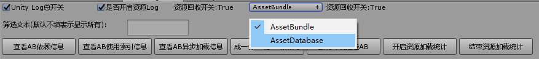

2. AB依赖信息查看界面

   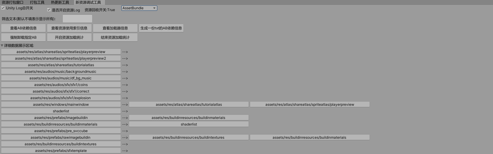

3. AB运行时加载管理详细信息界面

   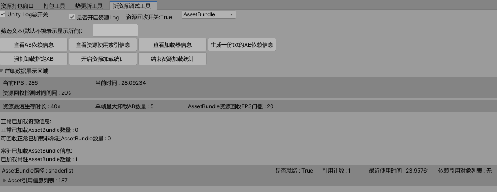

4. 加载器信息查看界面

   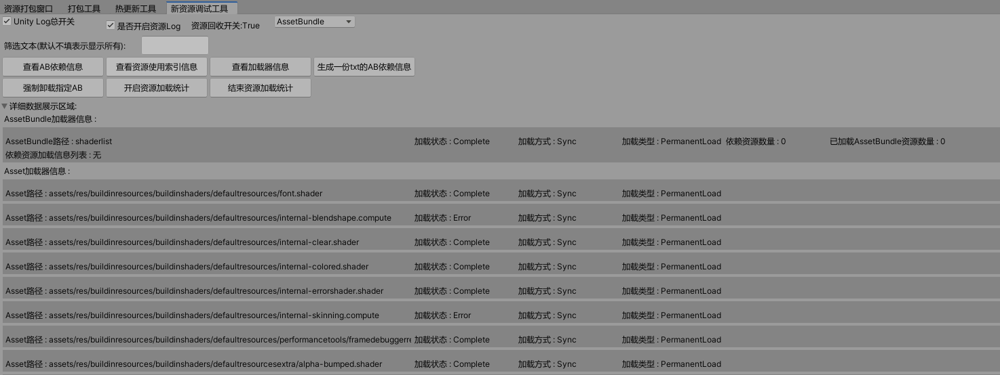

5. 测试界面

   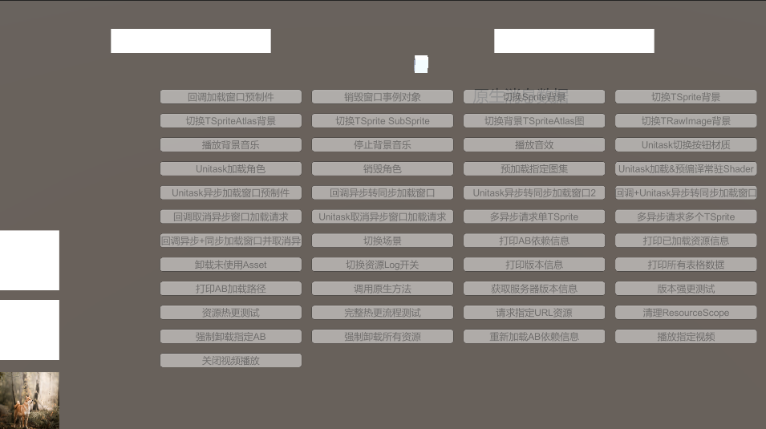

6. 点击加载窗口预制件按钮后:

   ```CS
   ResourceManager.Singleton.getPrefabInstance(
       "MainWindow.prefab",
       (prefabInstance, assetRequestHandle) =>
       {
           mMainWindow = prefabInstance;
           mMainWindow.transform.SetParent(UIRootCanvas.transform, false);
       },
       mResourceScope
   );
   ```
   
   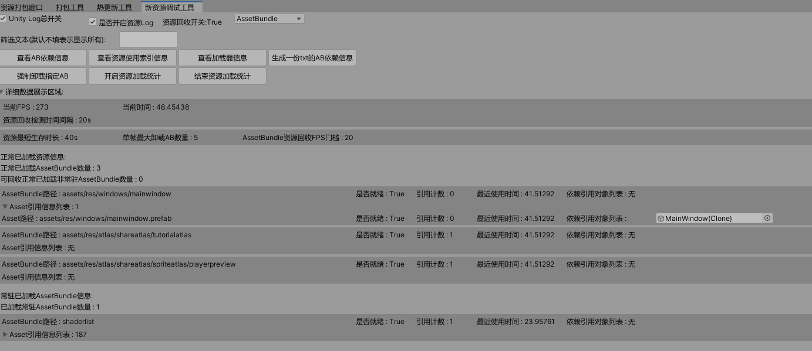
   可以看到窗口mainwindow依赖于loadingscreen，导致我们加载窗口资源时，loadingscreen作为依赖AB被加载进来了(引用计数为1)，窗口资源被绑定到实例出来的窗口对象上(绑定对象MainWindow)
   
7. 点击测试异步转同步加载窗口

```CS
/// <summary>
/// 测试异步转同步窗口加载
/// </summary>
public void onAsynToSyncLoadWindow()
{
    DIYLog.Log("onAsynToSyncLoadWindow()");
    if (mMainWindow == null)
    {
        onDestroyWindowInstance();
    }
    AssetLoader assetLoader;
    var assetRequestHandle = ResourceManager.Singleton.getPrefabInstanceAsync(
        "MainWindow.prefab",
        out assetLoader,
        (prefabInstance, assetRequestHandle) =>
        {
            mMainWindow = prefabInstance;
            mMainWindow.transform.SetParent(UIRootCanvas.transform, false);
        },
        mResourceScope
    );
    // 将异步转同步加载
    assetLoader.loadImmediately();
}
```

8. 点击销毁窗口实例对象后

```CS
/// <summary>
/// 销毁窗口实例对象
/// </summary>
public void onDestroyWindowInstance()
{
    DIYLog.Log("onDestroyWindowInstance()");
    GameObject.Destroy(mMainWindow);
}
窗口销毁后可以看到之前加载的资源所有绑定对象都为空了，因为被销毁了(MainWindow被销毁了)
```

​		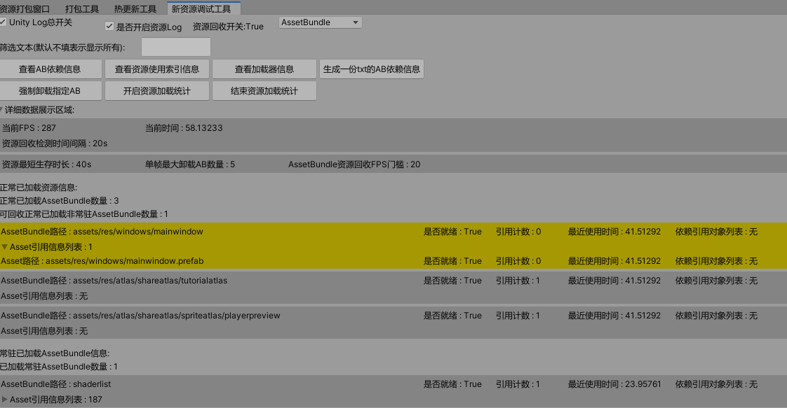

9. 等待回收检测回收后
   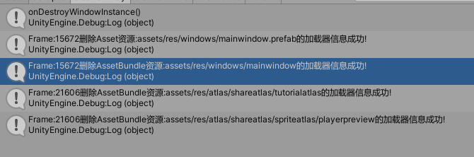
   上述资源在窗口销毁后，满足了可回收的三大条件(1. 索引计数为0 2. 绑定对象为空 3. NormalLoad加载方式)，最终被成功回收。

Note:

读者可能注意到shaderlist索引计数为0，也没绑定对象，但没有被卸载，这是因为shaderlist是被我预加载以常驻资源的形式加载进来的(PermanentLoad)，所以永远不会被卸载。

```CS
/// <summary>
/// 加载常驻Shader
/// </summary>
public void onLoadPermanentShaderList()
{
    DIYLog.Log("onLoadPermanentShaderList()");
    ResourceManager.Singleton.loadAllShader(() =>
    {
    },
    mResourceScope,
    ResourceLoadType.PermanentLoad);
}
```

### AssetBundle打包

**AB打包主要参考[MotionFramework](https://github.com/gmhevinci/MotionFramework)里的AB打包思路，细节部分个人做了一些改动和扩展。**

**AB打包设计:**

1. **打包AB的策略由抽象的目录打包策略设定决定**
2. **打包后的AB保留目录结构，确保AB模式和AssetDatabase模式加载都面向Asset路径保持一致性**
3. **支持打包策略级别的AB压缩格式设置(Note: 仅限使用ScriptableBuildPipeline打包模式)。老版AB打包流程AB压缩格式默认由打包面板压缩格式设置决定。**
4. **不支持AB变体功能(ScriptableBuildPipeline也不支持变体功能)，AB后缀名统一由打包和加载平台统一添加**
5. **老版AB依赖信息采用原始打包输出的*Manifest文件。新版ScriptableBuildPipeline采用自定义输出打包的CompatibilityAssetBundleManifest文件。**
6. **打包面板里支持了是否支持代码加载的勾选(用于支持文件名(含后缀)的资源加载和优化需要支持代码主动加载而生成的AssetBuildInfoAsset.asset(AB模式)和EditorAssetInfoAsset.asset(AssetDatabase模式)的数据量问题)**
7. **打包支持输出带MD5名字信息的AB文件，实际加载还是AssetBuildInfoAsset里记录的打包策略得出的AB名(带平台后缀)，同时打包会生成VerifyABInfo.json(用于校验热更的ABInfo.json文件)和ABInfo.json(存储了打包AB热更以及MD5换算相关信息)(2026/08/12)**

#### 打包策略支持

1. 按目录打包(打包策略递归子目录判定)

2. 按文件打包(打包策略递归子目录判定)

3. 按固定名字打包(扩展支持固定名字打包--比如所有Shader打包到shaderlist)(打包策略递归子目录判定)

4. 按文件或子目录打包(打包策略递归子目录判定，设定目录按文件打包，其他下层目录按目录打包)

5. 不参与打包(打包策略递归子目录判定)

#### 相关操作UI

这里先简单的看下新的AB搜集和打包界面:

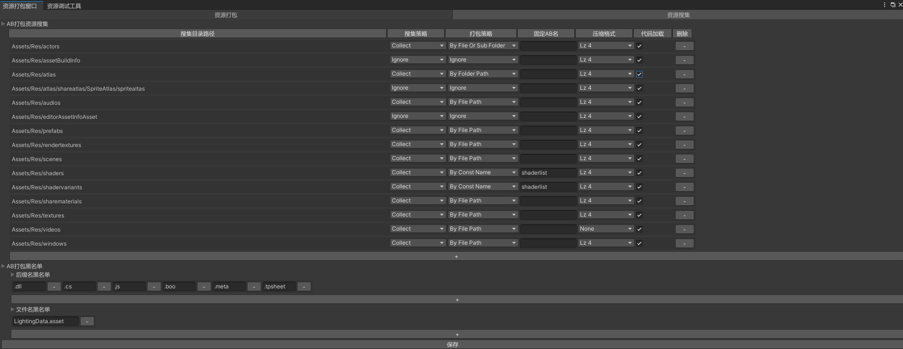

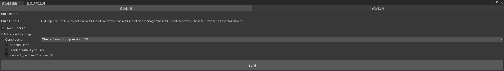

**AB模式**下关于Asset名，Asset路径和AB路径关联信息存在一个叫**AssetBuildInfoAndroid.asset**(不同平台名字不一样)的ScriptableObejct里(单独打包到assetBuildInfo的AB里)，通过Asset名如何加载到对应AB的关键就在这里。这里和MotionFramework自定义Manifest文件输出不一样，AssetBuildInfoAndroid.asset只记录Asset名，Asset路径和AB相关信息映射，不记录AB依赖信息，依赖信息依然采用AB打包生成的*Manifest文件，同时AssetBuildInfoAndroid.asset采用打包AB的方式（方便和热更新AB走一套机制）

让我们先来看下大致数据信息结构:

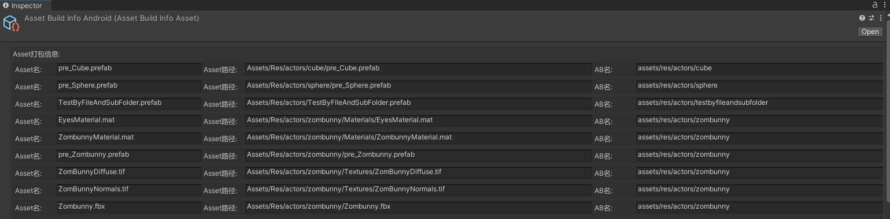

**AssetDatabase模式**下关于Asset名，Asset路径信息存储在**EditorAssetInfoAsset.asset**的ScriptableObject里(通过**Tools>AssetBundle->更新EditorAssetInfoAsset**触发更新)

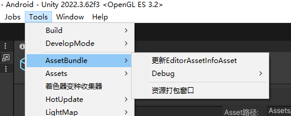

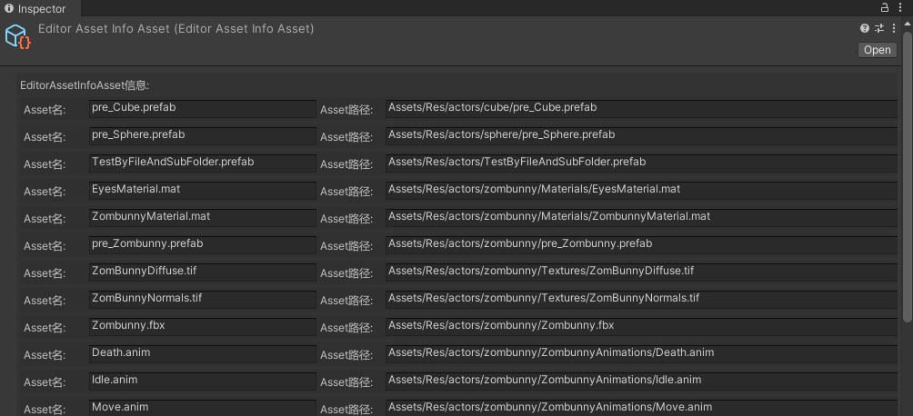

**2022/1/26支持了资源打包后缀名黑名单可视化配置+资源名黑名单可视化配置**

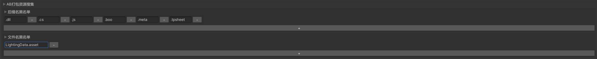

**2023/2/8底层支持了新版ScriptableBuildPipeline打包工具打包，加快打包速度(默认使用SBP，修改成老版打包需添加OLD_ASSET_BUILD_PIPELINE宏)**

**2026/8/12支持了带MD5名字的AB名生成和加载**

**2026/8/12优化了热更新的流程，利用VerifyABInfo.json和ABInfo.json保存的AB详细信息进行热更新判定和校验**

Note:

1. **注意将Assets/Res/assetbuildinfo目录设置成不参与打包的打包策略，此文件会在打包时独立设置打包。**

## 热更新模块

### 类说明

热更类：

```csharp
- HotUpdateModuleManager.cs(热更新管理模块单例类)
- TWebRequest.cs(资源下载http抽象类)
```

版本信息类：

```csharp
- VersionConfigModuleManager.cs(版本管理模块单例类)
- VersionConfig.cs(版本信息抽象类)
```

### 功能支持

1. 支持游戏内版本强更(完成 -- 暂时限Android，IOS待测试)
2. 支持游戏内资源热更(完成 -- 暂时限Android， IOS待测试)
3. 支持游戏内代码热更(未支持，**HybridCLR**待学习)

### 热更测试说明

使用阿里的ISS静态资源服务器做了一个网络端的资源服务器。

版本强更流程：

1. 比较包内版本信息和包外版本信息检查是否强更过版本
2. 如果强更过版本清空包外相关信息目录
3. 通过资源服务器下载最新服务器版本信息(ServerVersionConfig.json)和本地版本号作对比，决定是否强更版本
4. 结合最新版本号和资源服务器地址(Json配置)拼接出最终热更版本所在的资源服务器地址
5. 下载对应版本号下的强更包并安装
6. 安装完成，退出游戏重进

资源热更流程：

   1. 初始化本地ABInfo.json信息(优先包外)

   2. 通过资源服务器下载最新服务器版本信息(ServerVersionConfig.json)和本地资源版本号作对比，决定是否资源热更

3. 结合最新版本号，最新资源版本号和资源服务器地址(Json配置)拼接出最终资源热更所在的资源服务器地址

4. 下载对应地址下的VerifyABInfo.json(里面包含热更下载ABInfo.json的校验信息)

      VerifyABInfo.json

      ```json
      {
          "ABInfoFileSize": 11133,
          "ABInfoFileSha256": "ec28fd80d4a3dc44c95072555209dd22f7207e5e0d9e7456bf33ca2b69ebe44e"
      }
      ```

5. VerifyABInfo.json下载成功后根据比较对应地址下载ABInfo.json文件，下载下来的ABInfo.json先写入到本地临时热更目录(Stage目录)，根据热更ABInfo.json和本地的ABInfo.json信息比较得出需要更新下载的资源列表

      ABInfo.json

      ```json
      {
          "HotUpdateSingleABInfoList": [
              {
                  "ABRelativePath": "Android",
                  "ABMD5": "034739fc628faffa9024979c6d7d87d1",
                  "ABSize": 4785,
                  "ABSha256": "5d583b2dda00f5c842288e65fda0fe8aa70d9bde9d6d70f572621eef01367315"
              },
              ******
          }
      }
      ```

6. 根据得出的需要更新的资源列表下载对应资源地址下的资源下载先存储到临时热更目录(Stage目录)，通过ABInfo.json里的AB校验信息验证后移动到包外热更目录(Application.persistentDataPath + "/Android/")

7. 直到所有资源热更完成，我们将ABInfo.json移动到包外热更目录以供下次使用

8. 写入最新的热更版本号和资源版本号到包外。

9. 最后退出重进游戏，让热更新生效(或者等玩家自己下一次打开游戏时生效)

**问题:**

1. **上述方案包外ABInfo.json文件可能被篡改，其次热更下载的AB文件可能出现损坏但被记录到包外ABInfo.json的情况，这会导致热更AB出现不可逆的热更问题。**
2. **上述方案CDN不友好，每一次同一个资源更新都是同一个名字，CDN可能出现缓存污染。**
3. **上述方案直接下载到Application.persistentDataPath，没有原子操作，可能出现热更下载失败出现坏文件在Application.persistentDataPath的情况。**

**解决方案:**

1. **热更信息里新增VerifyABInfo.json(记录ABInfo.json的校验相关信息)，结合本地ABInfo.json数据与热更ABInfo.json文件进行对比决定哪些资源需要热更。(TODO)**
2. **将MD5信息添加到热更资源名字里，确保新的热更文件肯定不同从而确保不会因为CDN缓存污染出问题。**
3. **通过生成AB名，MD5，AB+MD5，AB文件大小，AB Sha256值等信息用于校验确保热更新的资源下载完成和正确，只有校验通过才会移动到包外热更资源目录，像ABInfo.json和热更完成的包外版本修改都在所有资源热更完成后执行(确保原子操作切换新版本资源加载)。**

### 流程图

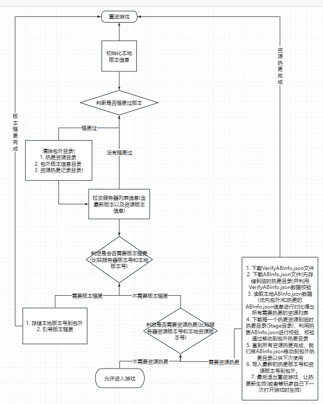

### 热更新辅助工具

Tools->HotUpdate->热更新操作工具

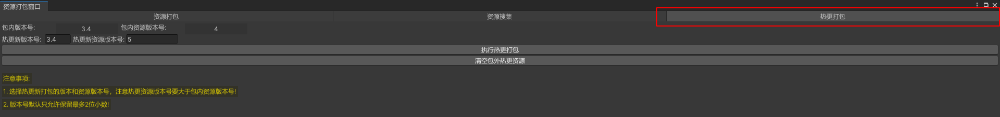

主要分为以下几个步骤：

1. AB打包(每次AB打包都输出到一个临时目录)
2. 将AB打包的AB资源复制到临时改名目录
3. 根据AB改名后的AB文件信息生成VerifyABInfo.json和ABInfo.json文件信息
4. 根据打包用途(e.g. 母包构建和热更构建)，将AB改名文件，VerifyABInfo.json和ABInfo.json文件复制到对应目标目录(比如母包构建移动到包内和Resources。热更构建移动到热更新准备目录)

打包临时目录结构:

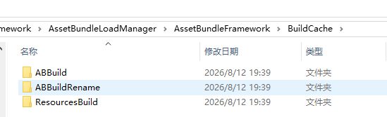

热更新准备目录结构:

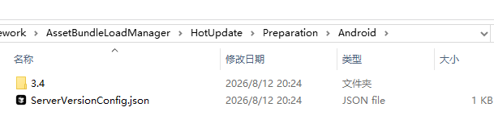

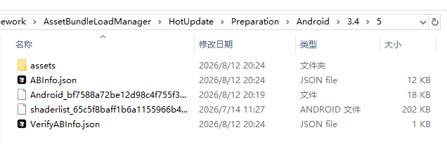

### 热更包外目录结构

PersistentAsset -> HotUpdate -> Platform(资源热更新目录)

PersistentAsset -> HotUpdate -> Stage(资源热更临时目录)

PersistentAsset -> HotUpdate -> Platform -> ABInfo.json(**记录最新AB的资源信息(含AB相对路径(含平台后缀)，文件MD5，文件大小，文件Sha256等**)
PersistentAsset -> Config -> VersionConfig.json(包外版本信息--用于进游戏前强更和热更判定)

PersistentAsset -> HotUpdate -> 版本强更包

## 辅助功能模块

### 资源处理分析

1. 支持资源依赖统计(不限资源类型)
2. 支持内置资源引用分析
3. 支持内置资源提取(限材质和纹理，不包含Shader是考虑到Shader可以自行下载) 
4. 支持shader变体搜集(半成品)

资源辅助工具五件套：

Tools->AssetBundle->AssetBundle操作工具

Tools->Assets->Asset相关处理

1. 资源依赖查看工具

   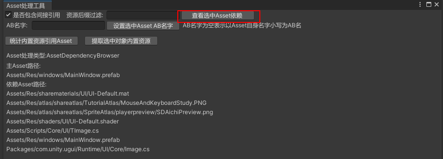

3. 内置资源依赖统计工具(只统计了*.mat和*.prefab，场景建议做成Prefab来统计)

   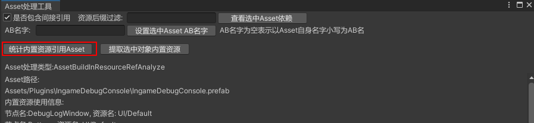

 4. 内置资源提取工具

    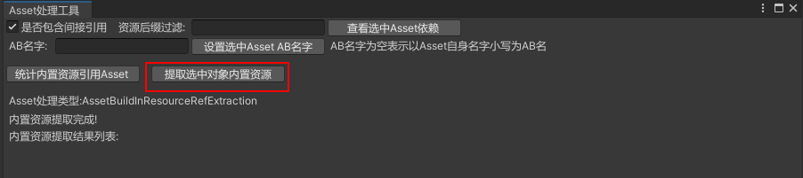

5. Shader变体搜集工具(**接入YooAsset的变体搜集工具**)

   **核心思想是搜集所有需要参与打包的材质球(含被动依赖不在打包策略内的)，然后通过单独的场景和摄像机去照射让ShaderVariantCollection去搜集**
   
   
   
   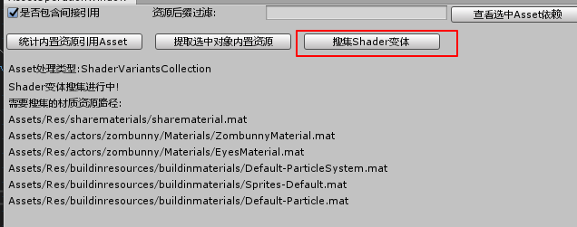 

# 注意事项

1. **Unity Hub启动时记着Window添加-force-gles命令，因为默认是打包的Android平台AB，不然AB模式会显示粉色**
2. **AB打包和加载默认使用SBP，修改成老版打包需添加OLD_ASSET_BUILD_PIPELINE宏**
3. **老版AB打包只支持Asset小写全路径，所以针对老版AB打包和加载Asset本人都统一成了小写处理**
4. **为了支持SpriteAtla和Sprite都能直接通过代码加载，需要将SpriteAtlas和参与打包的Sprite打包到一起**
5. **TImage和TRawImage提供了快速设置Sprite和Texture的相关接口(比如TImage.SetSingleSprite()和TRawImage.SetRawImage())**

# 重大问题修复

1. **修复资源打包在2020和2021版本会报错(BuildPipeline error is thrown when building Asset Bundles](https://issuetracker.unity3d.com/issues/buildpipeline-error-is-thrown-when-building-asset-bundles))问题(2022/06/03)**
2. **将面向Asset路径加载的方式改造成支持Asset名(含后缀)的加载方式(2026/07/14)**
3. **支持SubAsset的加载(比如Multiple Sprite)通过计数和对象绑定到主Asset实现SubAsset的加载和计数，详情参考AtlasManager.SetTImageSubSprite()方法(2026/07/21)**
4. **支持了特定上下文(比如窗口生命周期)的资源加载计数统计+资源计数释放+资源请求取消机制(ResourceScope类)。(2026/07/25)**
5. **支持了带MD5信息的AB名打包(解决CDN缓存问题)(2026/08/12)**
6. **支持了带文件Sha256值校验的资源热更新校验(2026/08/12)**

# 待做事项

**1. 支持类似Multiple Sprite这种SubAsset的加载(设计之初考虑的不够全面(无论是打包还是加载都是面向Asset级别的，导致SubAsset这种无论是打包还是加载都给不出有效Asset路径)，导致SubAsset这种资源无法主动加载到)⭐⭐⭐⭐⭐**

​		大框架不改的前提下，目前想到的最快速的方案是AssetLoader和AssetInfo都支持获取SubAsset的相关**同步接口**，**将计数和对象绑定都绑在主Asset身上**

**2. 支持真机代码热更(Lua + XLua)**

**3. 热更新资源正确性校验(MD5校验)**

# 个人博客

详细的博客记录学习:

[AssetBundle资源打包加载管理](http://tonytang1990.github.io/2018/10/24/AssetBundle%E8%B5%84%E6%BA%90%E6%89%93%E5%8C%85%E5%8A%A0%E8%BD%BD%E7%AE%A1%E7%90%86%E5%AD%A6%E4%B9%A0/)

[热更新](http://tonytang1990.github.io/2019/05/03/%E7%83%AD%E6%9B%B4%E6%96%B0/)

# 鸣谢

感谢tangzx/ABSystem作者的无私分享，tangzx/ABSystem的Github链接:

[tangzx/ABSystem](https://github.com/tangzx/ABSystem)

感谢MotionFramework作者的无私分享,MotionFramework的Github链接:

[MotionFramework](https://github.com/gmhevinci/MotionFramework)

感谢XAsset作者的无私分享,XAsset的GitHub链接:

[XAsset](https://github.com/xasset/xasset)